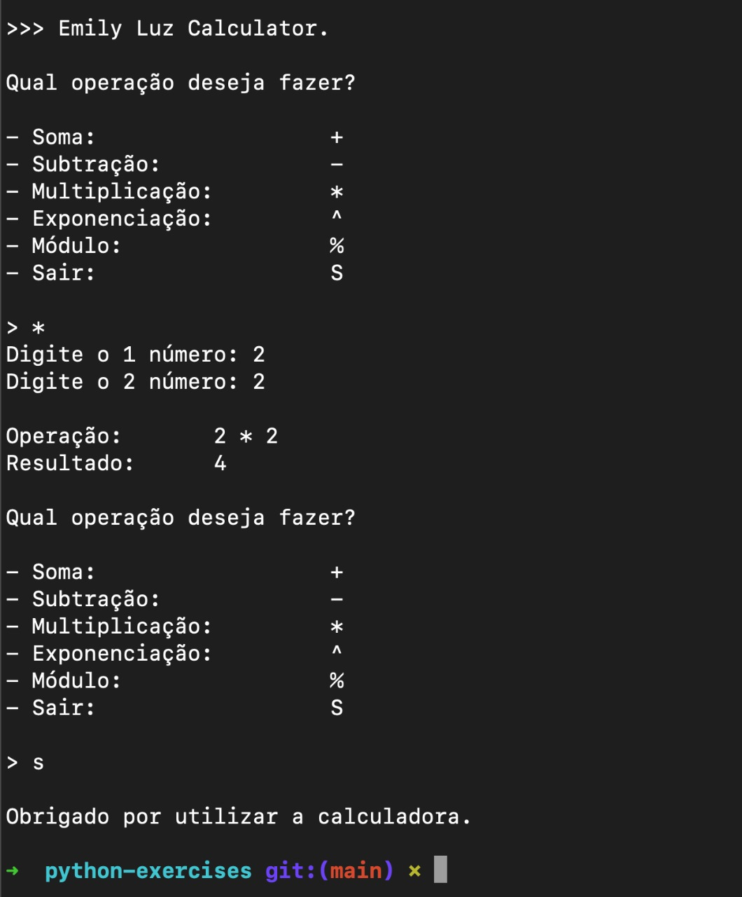
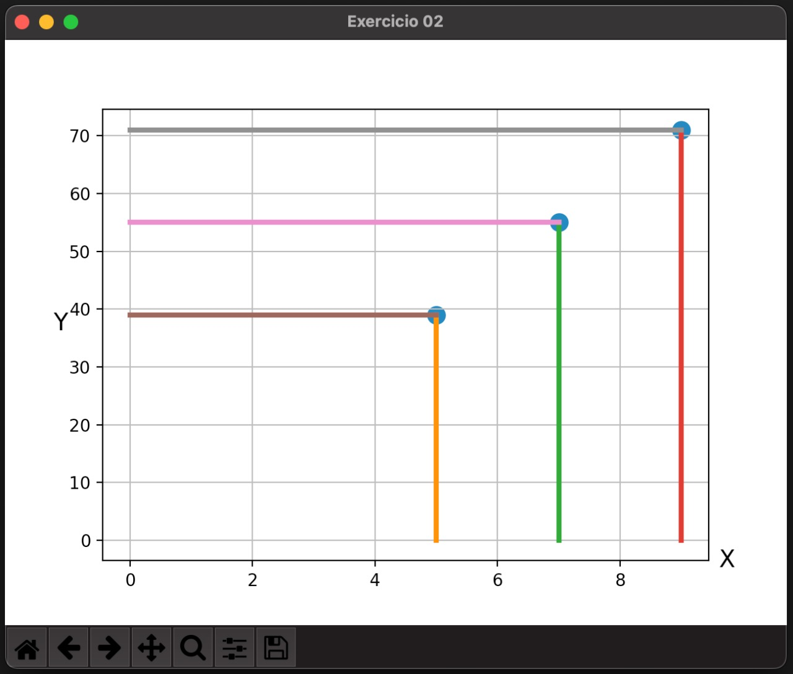

# python-exercises

-   1 Desenvolver a classe calculadora que faça qualquer operação matemática utilizando dois números inteiros, sendo os dois últimos números de seu RU.

    Caso o RU algum destes números sejam zero, substituí-lo(s) pelo número 1.

    Sendo as possíveis operações matemáticas:

    -   soma(+),
    -   subtração(-),
    -   multiplicação(\*),
    -   divisão(/),
    -   exponenciação(^) e
    -   módulo(%).

        Além destas funcionalidades, o algoritmo deverá ter um MENU que possíbilite ao usuário escolher qual o tipo de operação que se deseja realizar e que possibilite ao usuário a digitar os dois números.

        Apresentar todas as operações matemáticas da calculadora funcionando!

---

# Importante

Necessário executar

pip install matplotlib

-   2 Dada a equação linear y = ax + bx – c.

    Para os valores de a, b e c serão os
    três últimos números de seu RU. Caso, algum número do RU seja igual
    a zero, subistituí-lo(s) pelo número 3.

    Realizar o plot dos resultados, dado
    os valores de x1 = 5; x2 = 7 e x3 = 9.

    Para o plot você precisará utilizar a
    biblioteca matplotlib apresentada na Aula Prática 1;
    colocar legenda no gráfico, alterar a cor da linha(s) de seu gráfico;

    nomear o eixo x, nomear o eixo y.

    Exemplo:
    Meu RU: 205 103 -> por ter zzero fica assim: a =1; b=3; c=3

## Resultado 01

## Resultado 02

---

## Exercício 3

Realizar o upload do arquivo STORES.csv.

Renomear todas as colunas do arquivo STORES.csv,
onde os respctivos nomes sejam compactados

(Exemplo: Daily_Customer_Count foi renomeado para Visitantes).

Após isto, para se analisar o desempenho das lojas de supermercado/mercado do arquivo

STORES.csv encontre os valores mínimo, máximo, médio e desvio padrão das seguinte colunas:

"Items_Available"; "Daily_Customer_Count"; e "Store_Sales".

Algumas informações extras sobre a tabela do arquivo STORES.csv:

-   ID da loja: (Índice) ID da loja específica.
-   Store ID: Área Física da loja em pátio.
-   Store_Area: Número de itens diferentes disponíveis na loja correspondente.
-   DailyCustomerCount: Número de clientes que visitaram as lojas em média ao longo do mês.
-   Store_Sales: Vendas em (US$) que as lojas realizaram.

## Fontes de estudo

[Como desenhar um plano cartesiano](https://stackoverflow.com/questions/13430231/how-i-can-get-cartesian-coordinate-system-in-matplotlib)

[Como alterar o título da figura](https://stackoverflow.com/questions/5812960/change-figure-window-title-in-pylab)
